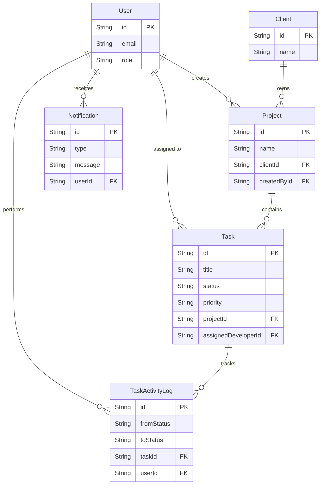

# Client Project Dashboard

A full-stack project management dashboard for tracking clients, projects, tasks, and developer activity.

## Stack

| Layer      | Technology                                   |
| ---------- | -------------------------------------------- |
| Frontend   | React 18 + TypeScript + Vite + Tailwind CSS  |
| Backend    | Node.js + Express + TypeScript               |
| ORM        | Prisma 5                                     |
| Database   | PostgreSQL 16                                |
| Auth       | JWT (access) + Refresh Token (HttpOnly cookie) |
| Real-time  | Socket.io                                    |
| Scheduler  | node-cron                                    |
| Container  | Docker Compose                               |

**Socket.io over native `ws`:** Socket.io adds automatic reconnection with exponential backoff, a room/namespace abstraction that maps directly to our project-scoped broadcast model, and a `handshake.auth` object that lets the client pass the JWT cleanly before the connection is established. The reconnection behaviour alone eliminates a class of bugs (silent disconnect, stale feed) that would require manual implementation with raw `ws`.

**node-cron over Bull:** For a single-instance application without a dedicated Redis cluster, `node-cron` is vastly simpler and avoids the infrastructural overhead of Bull/Redis while perfectly serving our interval-based overdue checking requirements.


---

## Why Express over Fastify?

This project uses **Express** rather than Fastify for the following reasons:

1. **Middleware ecosystem** — `helmet`, `express-rate-limit`, `cookie-parser`, `morgan`, and `passport` all have battle-tested, first-class Express integrations. Porting or finding equivalents for Fastify adds maintenance risk.
2. **JWT + Role guard pattern** — Express's `(req, res, next)` chain is the ideal primitive for composing `verifyToken → requireRole → handler` middleware pipelines. The patterns are well-documented and widely understood.
3. **Team onboarding** — Express is the de-facto standard. Developers unfamiliar with Fastify's plugin lifecycle (`fastify.register`) can contribute to an Express codebase on day one.
4. **Prisma alignment** — Prisma's official examples, error-handling guides, and community resources are predominantly Express-based.
5. **Not throughput-bound** — A dashboard application is DB-latency-bound, not framework-latency-bound. Fastify's raw JSON throughput advantage (~10–15%) is not a meaningful win here.

> Fastify remains a valid choice if this service evolves into a high-throughput API gateway or microservice with strict p99 latency SLAs.

---

## Auth Token Strategy

```
Access Token:   JWT, 15 min TTL
                Sent as: Authorization: Bearer <token>
                Stored:  In-memory (React context) — NOT localStorage

Refresh Token:  JWT, 7 day TTL
                Sent as: HttpOnly + Secure + SameSite=Strict cookie
                Route:   POST /auth/refresh  (rotates the token)
                Logout:  POST /auth/logout   (clears the cookie server-side)
```

### Why NOT localStorage for access tokens?

`localStorage` is accessible by any JavaScript running on the page. A single XSS vulnerability — even in a third-party dependency — can silently exfiltrate every stored token. Storing the access token in-memory (React state/context) means:

- It is never written to a browser-accessible storage API.
- It is destroyed automatically when the tab is closed.
- The only attack surface is the HttpOnly refresh-token cookie, which JavaScript **cannot read**.

The trade-off is that a hard refresh loses the access token, but a silent re-authentication via `POST /auth/refresh` (triggered on app mount) restores the session transparently without requiring the user to log in again.

### Refresh Token Rotation

Every call to `POST /auth/refresh` issues a **new** refresh token and invalidates the old one. This limits the window of opportunity if a refresh token is ever leaked. Full refresh-token family tracking (reuse detection) is a planned future enhancement.

---

## Database Schema



---

## Project Structure

```
Velozity/
├── client/          # React + Vite + Tailwind frontend
├── server/          # Express + Prisma backend
│   ├── prisma/
│   │   └── schema.prisma
│   └── src/
│       ├── config.ts
│       ├── index.ts
│       ├── lib/
│       │   ├── jwt.ts
│       │   └── prisma.ts
│       ├── middleware/
│       │   ├── auth.ts
│       │   └── requireRole.ts
│       └── routes/
│           ├── auth.ts
│           └── health.ts
├── docker-compose.yml
└── README.md
```

---

## Quick Start (Docker)

### Prerequisites
- Docker Desktop
- Node.js 20+

### 1. Copy environment file
```bash
cp server/.env.example server/.env
# Edit server/.env with your secrets
```

### 2. Start all services
```bash
docker-compose up --build
```

Services:
| Service  | URL                        |
| -------- | -------------------------- |
| Client   | http://localhost:5173      |
| Server   | http://localhost:4000      |
| Postgres | localhost:5432             |

### 3. Verify
```bash
curl http://localhost:4000/health
# → {"status":"ok","timestamp":"..."}
```

---

## Local Development (without Docker)

### Prerequisites
- Node.js 20+
- PostgreSQL 16 running locally

### Server
```bash
cd server
npm install
cp .env.example .env
# Fill in DATABASE_URL in .env
npm run db:migrate     # runs prisma migrate dev
npm run db:generate    # runs prisma generate
npm run dev            # starts ts-node-dev
```

### Client
```bash
cd client
npm install
npm run dev
```

### Seeding the Database
To populate the database with realistic sample data (users, projects, tasks, activity logs, and notifications):
```bash
cd server
npm run db:seed
```

#### Seeded Credentials
All seeded users share the exact same password: `password123`

- **Admin**: `admin@velozity.com`
- **PMs**: `pm1@velozity.com`, `pm2@velozity.com`
- **Developers**: `dev1@velozity.com` ... `dev4@velozity.com`

---

## Deployment

### Frontend (Vercel)
1. Import the repository into Vercel.
2. Set the Root Directory to `client`.
3. Override the build command to `npm run build` and output to `dist`.
4. Set the Environment Variable:
   - `VITE_API_URL`: The URL of your deployed backend (e.g., `https://api.velozity.onrender.com`).

### Backend & Database (Render / Railway)
1. Create a Managed PostgreSQL instance.
2. Create a Web Service for the Node.js backend.
3. Set the Root Directory to `server`.
4. Build command: `npm install && npm run build && npm run db:migrate:prod`
5. Start command: `npm start`
6. Required Environment Variables:
   - `DATABASE_URL`: Your managed Postgres connection string.
   - `NODE_ENV`: `production`
   - `PORT`: Automatically provided by Render/Railway.
   - `ACCESS_TOKEN_SECRET`: A secure 32+ char random string.
   - `REFRESH_TOKEN_SECRET`: A secure 32+ char random string.
   - `CLIENT_ORIGIN`: Your deployed Vercel URL (e.g., `https://velozity-client.vercel.app`).

---

## Known Limitations

1. **Refresh Token Reuse Detection**: The current implementation rotates refresh tokens but does not yet invalidate the entire token family if a revoked token is reused.
2. **Soft Deletes**: Deleting projects cascades and hard-deletes tasks and logs. A soft-delete (`deletedAt`) pattern would be required for a strict audit compliance environment.
3. **Single Node Scheduler**: `node-cron` runs purely in memory on the single instance. If the backend is horizontally scaled across multiple instances, a distributed queue like `Bull` + `Redis` must replace it to prevent redundant job execution.

---

## API Reference

### Auth

| Method | Path           | Body / Notes                        | Auth Required |
| ------ | -------------- | ----------------------------------- | ------------- |
| POST   | /auth/signup   | `{ email, password, role }`         | No            |
| POST   | /auth/login    | `{ email, password }`               | No            |
| POST   | /auth/refresh  | (reads HttpOnly cookie)             | No            |
| POST   | /auth/logout   | (clears HttpOnly cookie)            | Bearer token  |

### Health

| Method | Path     | Response               |
| ------ | -------- | ---------------------- |
| GET    | /health  | `{ status: "ok", timestamp }` |

---

## Roles & Permissions

| Role        | Capabilities                                       |
| ----------- | -------------------------------------------------- |
| `ADMIN`     | Full access to all resources                       |
| `PM`        | Create/manage projects, assign tasks               |
| `DEVELOPER` | View assigned tasks, update task status            |

Every protected route explicitly declares its allowed roles via `requireRole(['ADMIN', 'PM'])` middleware — there is no implicit trust of any frontend claim.

---

## Environment Variables

See `server/.env.example` for all required variables.

| Variable              | Description                              |
| --------------------- | ---------------------------------------- |
| `DATABASE_URL`        | PostgreSQL connection string             |
| `ACCESS_TOKEN_SECRET` | Secret for signing JWT access tokens     |
| `REFRESH_TOKEN_SECRET`| Secret for signing JWT refresh tokens    |
| `ACCESS_TOKEN_TTL`    | Access token lifetime (default: `15m`)   |
| `REFRESH_TOKEN_TTL`   | Refresh token lifetime (default: `7d`)   |
| `CLIENT_ORIGIN`       | Allowed CORS origin (e.g. `http://localhost:5173`) |
| `PORT`                | Server port (default: `4000`)            |
| `NODE_ENV`            | `development` or `production`            |
